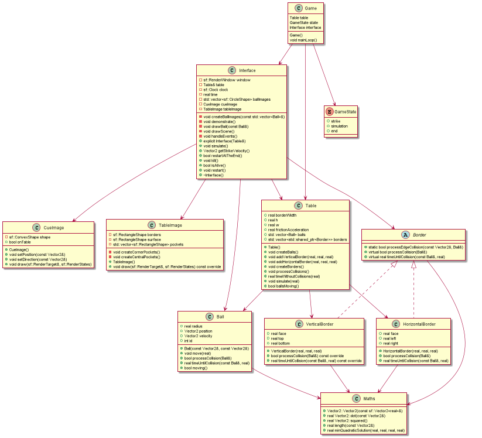

# Billiards

## Описание игры

Цель нашей однопользовательской игры до невозможности простая: уложить все 15 шаров(кроме главного, разумеется) в лунки. Время не ограничено, количество попыток не ограничено, так что тренируйся здесь и стань чемпионом в реальной жизни:)

## Сборка под Windows

Необходимо скачать библиотеку SFML, если она не скачана:
https://www.sfml-dev.org/download.php

Для запуска проекта используются следующие команды в PowerShell:

```powershell
mkdir build
cd build
cmake -G"MinGW Makefiles" -DSFML_DIR=<PATH-TO-SFML>/lib/cmake/SFML ..
cmake --build .
./Billiards.exe
```

## Сборка под Linux (Debian/Ubuntu)

Необходимо установить библиотеку SFML, если она не установлена:

```bash
$ sudo apt install libsfml-dev
```

Для запуска проекта используются следующие команды Bash:

```bash
$ mkdir build
$ cd build
$ cmake ..
$ cmake --build .
$ ./Billiards
```

## Архитектура проекта

Оформлена UML-диаграммой под названием `Architecture.png`, её описание лежит в `Architecture.puml`


